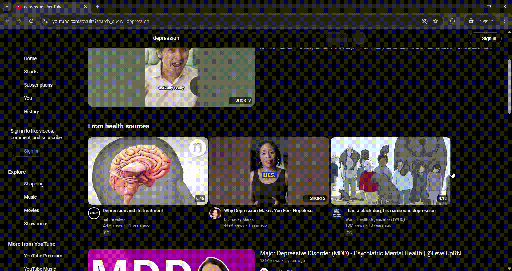
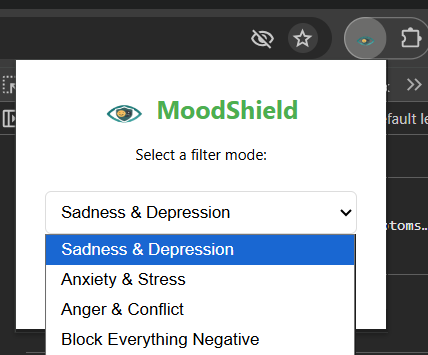
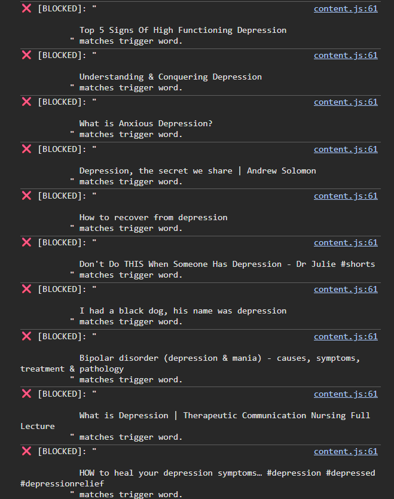

# 🛡️ MoodShield - Mental Health Protection for YouTube

**MoodShield** is a privacy-first Chrome Extension designed to create a safer digital environment. It proactively filters triggering content on YouTube, allowing users to block videos related to **Sadness, Anxiety, or Anger** in real-time.

---

## 🎥 Visual Demo
*Watch MoodShield detect and remove triggering content from the feed.*

> **⚠️ Note on the Demo:** The red highlighting seen in the GIF above is for **demonstration purposes only** to visualize the detection algorithm working. The actual production version removes content **instantly and invisibly** for a seamless user experience.

---

## 🖼️ User Interface & Options
MoodShield provides a simple dropdown menu allowing users to switch between protection modes instantly.

### 1. Select Your Protection Mode
Users can filter specific categories based on their current mental state:
* **Sadness & Depression**
* **Anxiety & Stress**
* **Anger & Conflict**
* **Block Everything Negative**

### 2. Technical Verification (Console Log)
The extension logs every interception in the developer console, proving that specific content is being identified and blocked based on the active mood filter.

---

## ✨ Key Features
* **🧠 Mood-Based Filtering:** Dynamic keyword lists update instantly based on user selection.
* **🚫 Omni-Channel Protection:** Custom algorithms detect and remove toxic content from the Homepage, Search Results, and the Shorts Shelf.
* **⚡ Zero-Latency Mode:** Content is blocked immediately upon DOM injection.
* **🔒 Privacy First:** No data leaves your browser. All settings are stored locally using the Chrome Storage API.

---

## 🛠️ Installation (Developer Mode)
1.  Clone or download this repository.
2.  Open Chrome and navigate to `chrome://extensions`.
3.  Enable **Developer Mode** (toggle in the top right).
4.  Click **"Load Unpacked"**.
5.  Select the **MoodShield** folder.

---

## 🚀 Future Roadmap
* **v1.1:** Add "Custom Blocklist" feature allowing users to input their own trigger words.
* **v1.2:** Implement Sentiment Analysis (NLP) for context-aware filtering.
* **v2.0:** Expand support to Twitter/X and Reddit.

---
*Developed as a Digital Wellbeing initiative.*